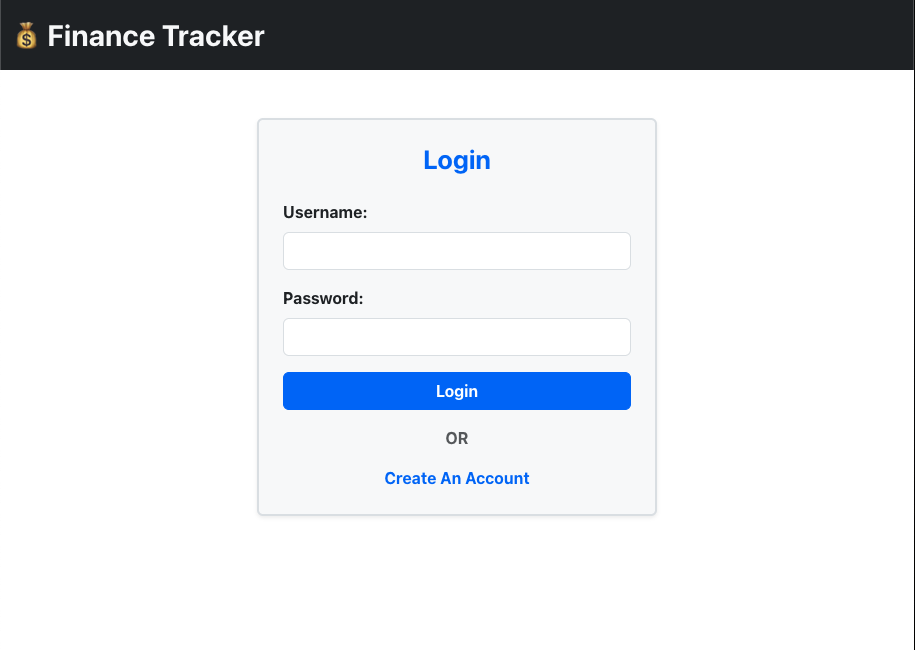
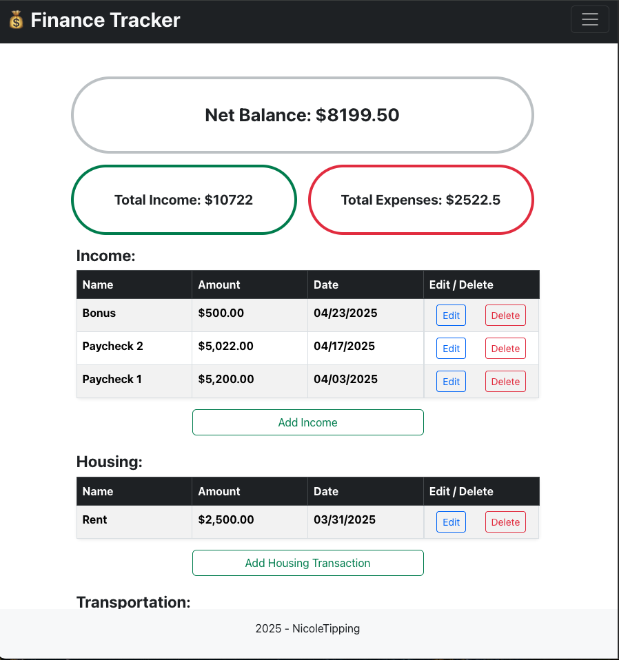

# Finance Tracker

This is a full-stack Finance Tracker application that helps users manage their personal finances. The app allows users to track transactions, view monthly summaries, and categorize expenses.

**Login Page**:


**Transaction Page**:



## Features
- User registration and login
- Add and edit transactions
- Categorize transactions as income or expense
- View transaction history
- Secure authentication using JSON Web Tokens (JWT)

## Tech Stack

### Frontend
- **React.js**: A JavaScript library for building user interfaces
- **Redux**: State management for React
- **Axios**: For making HTTP requests to the backend
- **Bootstrap**: For styling the UI

### Backend
- **Node.js**: JavaScript runtime for the backend
- **Express.js**: Web framework for Node.js
- **MongoDB**: NoSQL database to store user and transaction data
- **Mongoose**: MongoDB object modeling for Node.js
- **JWT (JSON Web Tokens)**: For secure user authentication

### Database
- **MongoDB**: Used for storing transaction data and user information.
  - The database stores collections for users, transactions, and categories.

## Setup

### Prerequisites
Make sure you have the following installed:
- **Node.js**: [Install Node.js](https://nodejs.org/en/)
- **MongoDB**: [Install MongoDB](https://www.mongodb.com/try/download/community) (if running locally, or you can use MongoDB Atlas for a cloud database)

### Backend Setup
1. Navigate to the `Finance-Tracker Backend` directory:
   ```bash
   cd Finance-Tracker/Backend

2. Install dependencies:

        npm install

3. Start the backend server:

        npm start

    - The backend will run on http://localhost:5000 by default.

### Frontend Setup

1. Navigate to the Finance-Tracker Frontend directory:

        cd Finance-Tracker/Frontend

2. Install dependencies:

        npm install

3. Start the frontend development server:

        npm start
    
        The frontend will be accessible at http://localhost:3000.

## Environment Variables

Create a .env file in the backend directory and add the following:

    MONGODB_URI=<your_mongodb_connection_string>
    JWT_SECRET=<your_jwt_secret>

## Contributing

If you'd like to contribute to this project, feel free to fork the repository and submit a pull request. Contributions are always welcome!


## License

This project is licensed under the MIT License - see the LICENSE file for details.
